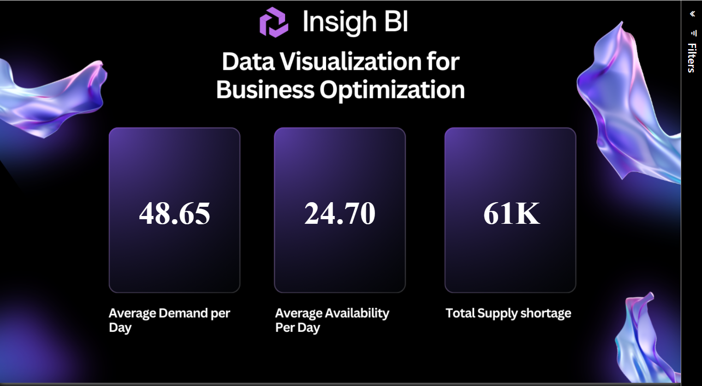
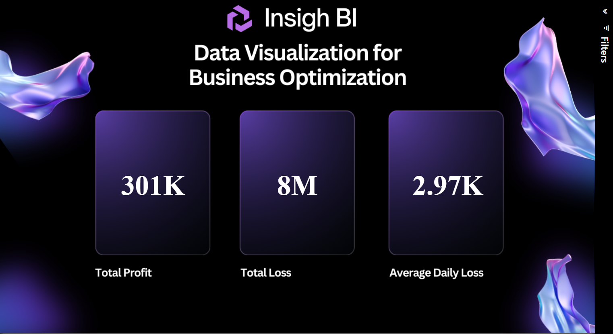

#  PROD Report

This project delivers **inventory demand, availability, and financial performance insights** using **SQL Server (converted from MySQL)** for data analysis and **Power BI** for interactive visualization.

* [**🔗 Dashboard (MySQL Analysis)**](https://app.powerbi.com/groups/96685ea3-1fc0-4c05-b1b2-07c13e12fcd1/reports/23323817-283d-4544-be05-c8d669bbc896/e1f42600044280777c1b?experience=power-bi)
* [**🔗 Dashboard (SQL Server Analysis)**](https://app.powerbi.com/groups/12a8b75e-3999-4a19-85c8-73dba02cada1/reports/2b0cf0d3-a59a-4735-95c4-8baa946e1177/e1f42600044280777c1b?experience=power-bi)

---

## 📂 Datasets

The analysis is based on three datasets, separated into **test** and **production** environments. The dashboards can dynamically switch between them to compare performance.

* [Products Dataset](https://drive.google.com/file/d/1zyo3bYatdoTmdQmcmf1kQjwRUQymU_WB/view?usp=drive_link)
* [Test Environment Inventory Dataset](https://drive.google.com/file/d/1qQ-Izky59TtudczweSch0HBWLspDbKyA/view?usp=drive_link)
* [Production Inventory Dataset](https://drive.google.com/file/d/1VkH3BgKSBTf8vGTf3qyt32vNujg1R4e-/view?usp=drive_link)

---

##  Project Overview

The dashboards reveal **supply-demand imbalances** and their **financial consequences**.
To make the analysis more interactive, filters for **`Order_Date_DD_MM_YYYY`** and **`Product_Name`** were added.
These allow users to drill down into specific time periods and product-level insights.

In addition, both **test** and **production datasets** can be loaded, enabling comparative analysis of different environments and verifying the accuracy of the reporting pipeline.

---

##  Dashboard Insights

###  Supply & Demand Metrics


* **Average Demand per Day**: **48.65**
* **Average Availability per Day**: **24.70**
* **Total Supply Shortage**: **61K**

 Demand consistently outpaces supply, leading to **persistent shortages**.

---

###  Financial Performance


* **Total Profit**: **301K**
* **Total Loss**: **8M**
* **Average Daily Loss**: **2.97K**

 Losses are significantly higher than profits, largely driven by unfulfilled demand.

---

##  Data Preparation Steps

### 1. **Created Test Environment Database**

```
create database test_env;
use test_env;

select * from [dbo].[Products];
select * from [dbo].[Test Environment Inventory Dataset];
```
 Purpose: Create a test database to experiment safely. Load the products and test inventory datasets to validate structure and sample contents.
### 2. **Joined Inventory with Product Metadata**

```
select 
    a.Order_Date_DD_MM_YYYY,
    a.Product_ID,
    a.Availability,
    a.Demand,
    b.Product_Name,
    b.Unit_Price
from [dbo].[Test Environment Inventory Dataset] as a
left join [dbo].[Products] as b 
    on a.Product_ID = b.Product_ID;
```
Purpose: Combine inventory records (availability, demand) with product details (name, price).
A LEFT JOIN ensures all inventory data is retained, even if some products are missing in the metadata table.
### 3. **Created a Clean Table for Analysis**

```
select * into New_table from (
    select 
        a.Order_Date_DD_MM_YYYY,
        a.Product_ID,
        a.Availability,
        a.Demand,
        b.Product_Name,
        b.Unit_Price
    from [dbo].[Test Environment Inventory Dataset] as a
    left join [dbo].[Products] as b 
        on a.Product_ID = b.Product_ID
) x;
```
Purpose: Save the joined data into a new clean table for faster queries and easier integration with Power BI.
Acts as a staging table for analysis.
### 4. **Production Database Setup & Data Cleaning**

```
create database PROD;
use PROD;

select * from [dbo].[Prod Env Inventory Dataset];
```
Purpose: Load the production dataset in its own environment for real-world analysis.
* **Handled Null / Blank Dates**

```
select distinct Order_Date_DD_MM_YYYY
from [dbo].[Prod Env Inventory Dataset]
where Order_Date_DD_MM_YYYY is null or Order_Date_DD_MM_YYYY = '';
```
Identifies records with blank or missing dates that could cause reporting issues.
* **Corrected Product IDs**

```
update [dbo].[Prod Env Inventory Dataset]
set Product_ID = 7 where Product_ID = 21;

update [dbo].[Prod Env Inventory Dataset]
set Product_ID = 11 where Product_ID = 22;
```
Fixes incorrect product mappings to align with the master Products table.
### 5. **Final Production Dataset**

```
select * into New_table from (
    select 
        a.Order_Date_DD_MM_YYYY,
        a.Product_ID,
        a.Availability,
        a.Demand,
        b.Product_Name,
        b.Unit_Price
    from [dbo].[Prod Env Inventory Dataset] as a
    left join [dbo].[Products] as b 
        on a.Product_ID = b.Product_ID
) x;
```
Purpose: Build a final, cleaned dataset in production by merging inventory with product details.
This table is the one consumed by Power BI dashboards.
---

##  Tools & Technologies

* **SQL Server (converted from MySQL)** → Data preparation, cleaning, and transformation
* **Power BI** → Dashboarding with interactive filters (`Order_Date_DD_MM_YYYY`, `Product_Name`)
* **Test & Production datasets** → Dynamic switching for validation and environment comparison

---

##  Key Takeaways

* A **supply gap of 61K units** highlights inefficiencies in meeting customer demand.
* **Losses (8M)** far exceed **profits (301K)**, showing how shortages directly erode financial performance.
* Filtering by **date** and **product** enables deeper insights and root-cause investigation.
* The ability to **toggle between test and production datasets** strengthens analysis consistency and ensures reliability of insights.

